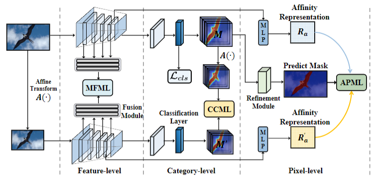

# Pytorch implementation of "An Efficient End-to-End Weakly-Supervised Semantic Segmentation Framework with Representation Mutual Learning for Robotic Applications" (Under Review).

<div align="center">
  
</div>


### License me ###
**This code is only for reviewers to understand implementation details.**

This code is available only for non-commercial use.

### Installation  ###

Install dependencies:
```
pip install -r requirements.txt
```
### Data Preparation  ###

Download VOC dataset:

```
wget http://host.robots.ox.ac.uk/pascal/VOC/voc2012/VOCtrainval_11-May-2012.tar
tar –xvf VOCtrainval_11-May-2012.tar
```

Download COCO dataset:

```
wget http://images.cocodataset.org/zips/train2014.zip
wget http://images.cocodataset.org/zips/val2014.zip
```

### Training ###
Download  Pre-trained weights:

```
https://github.com/NVlabs/SegFormer
```

Training on VOC:
```
bash train/run_RML_voc.sh
```
Training on COCO:

```
bash train/run_RML_voc.sh
```

### Thanks ###

Some implementation code comes from：

AFA：https://github.com/rulixiang/afa.git

SegFormer：https://github.com/NVlabs/SegFormer

1Stage：https://github.com/visinf/1-stage-wseg


